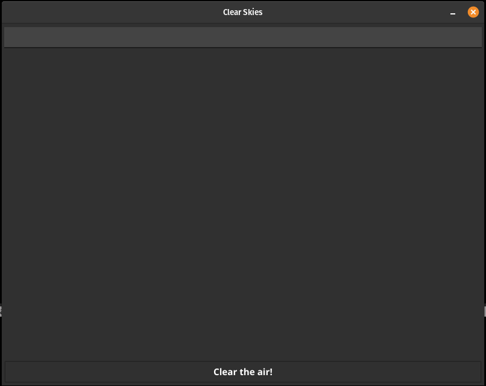

<strong>Clear Skies</strong>

Utility designed to check for tweets about a user every 5 seconds, displaying them in list in a window. It will scrub tweets out based off a word-based sentiment analysis with thresholding, with hard scrubs of banned usernames.&nbsp;

On first run, creates "config.txt", with a blank twitter handle, and a baseline sentiment gate of -.5. This should be enough to skip the truely vulgar tweets, while still allowing for some negative sentiment (i.e. the difference between "I don't like content X" and "I hate everything about you"). Clear Skies must be restarted every time the sentiment gate is changed, but will scrub banned handles in real time.&nbsp;

Banned handles can be entered either in the top bar of the application, or manually added to the "ban.list" file.   

